```{r setup, include=FALSE}
options(htmltools.dir.version = FALSE)
```

background-size: cover
class: center, middle, inverse

# Geographical data mining

---
# Minería de datos geográficos:La nueva moneda
.pull-left[
Según **Openshaw**, profesor del Centro de Geografía Computacional de la Universidad Leeds en Reino Unido,este término hace referencia a **la inmensa explosión en los datos geográficos** ocasionados por el desarrollo en la tecnología informática, sensores remotos, Mapeo digital y la difusión global del SIG.

<br>
##### _Paper de Openshaw_ [aquí](http://www.geocomputation.org/1999/051/gc_051.htm)
]

.pull-left[

```{r,echo=FALSE,fig.align='center',out.width='200px',out.height='300px'}
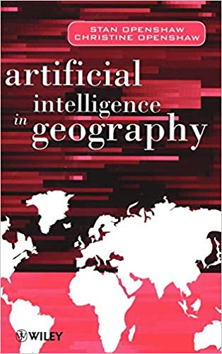
```

]

---
# Otro concepto

.pull-left[
**La velocidad en la que se generan los datos geoespaciales supera nuestras capacidades computacionales** para extraer patrones para la comprensión de un mundo que cambia dinámicamente, la geoinformática y la minería de datos se centra en el desarrollo e implementación de algoritmos computacionales para resolver estos problemas.(**Cervone y Lin ,2014**).
]

.pull-right[
```{r,echo=FALSE,fig.align='center',out.width='200px',out.height='300px'}
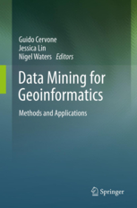
```
]
---
# Entonces:

Geographical Data Mining hace referencia al inmenso volumen de datos georreferenciados que se van generando de manera continua, y que hoy en día en su mayoria están disponibles en fuentes abiertas dentro de mundo online de internet.

# Conclusión:

En esta nueva geografía aparece un nuevo espacio de relación, el entorno digital, al que denominamos cibergeografía (**Fuenzalida, Buzai, Jiménez, y de León Loza, 2015**). No se trata de una nueva disciplina, sino de una evolución en lo que, quizás, sea el cambio más importante desde que Alexander Von Humboldt iniciara lo que se considera la geografía moderna (**Capel Sáez, 1981**).

---
# Fuentes de información geográfica abierta 
# WorldPop
Posee información espacial y temporal de la demografía a una resolución de 100m

```{r,echo=FALSE,fig.align='center', out.height='320px', out.width ='550px'}
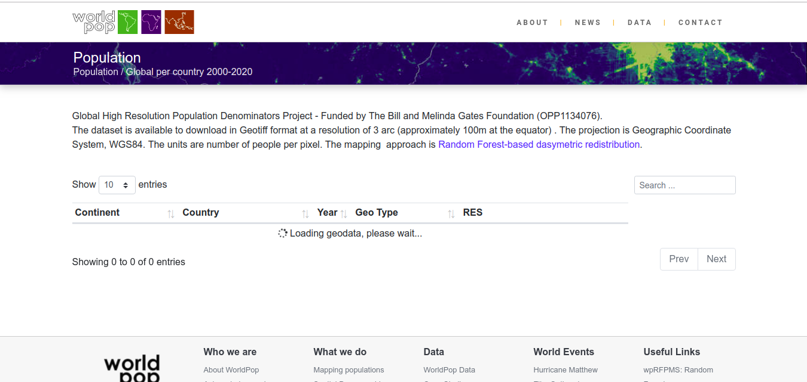
```

##### _Link de WorldPop_ [aquí](https://www.worldpop.org/geodata/listing?id=29)

---
# SRTM
Modelos de elevación digital de terreno de 30 m  

```{r,echo=FALSE,fig.align='center', out.height='420px'}
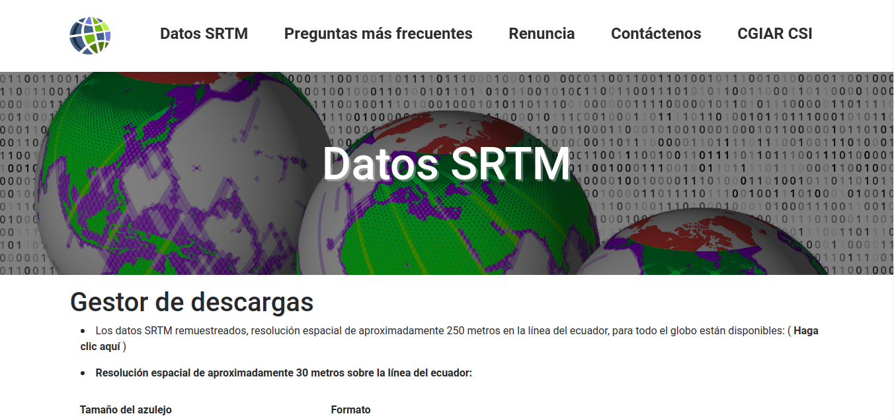
```

##### _Link de SRTM_ [aquí](http://srtm.csi.cgiar.org/srtmdata/)

---
# Jaxa DEM
Modelos digitales de superficie de 30 m 

```{r,echo=FALSE,fig.align='center'}
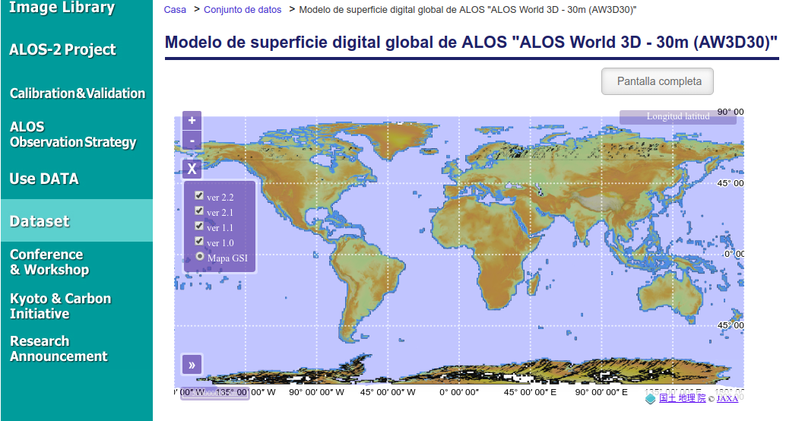
```

##### _Link de Jaxa DEM_ [aquí](https://www.eorc.jaxa.jp/ALOS/en/aw3d30/index.htm)

---
# GEE
Posee diferentes base de datos de imágenes satelitales entre las más inportantes destaca la serie de Landsat, MODIS y Sentinel.

```{r,echo=FALSE,fig.align='center'}
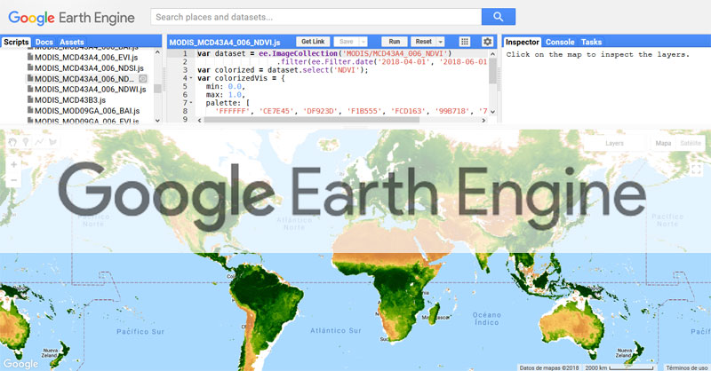
```

##### _Link de GEE_ [aquí](https://code.earthengine.google.com/afb96dd57557f0c2b56693fdd15f8309)

---
# Map the malaria atlas project
Posee información sobre el tiempo de viaje que tarda una persona en trasladarce a una ciudad más cercana.
```{r,echo=FALSE,fig.align='center', out.height='400px'}
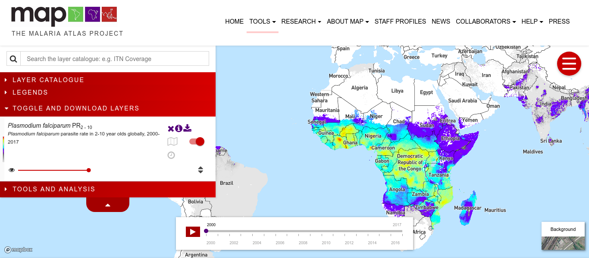
```

##### _Link de Map the malaria atlas project_ [aquí](https://map.ox.ac.uk/trends/country)

---
# Worldclim
Datos de variables climáticas como la Pp, T y otras variables bioclimáticas 

```{r,echo=FALSE,fig.align='center'}
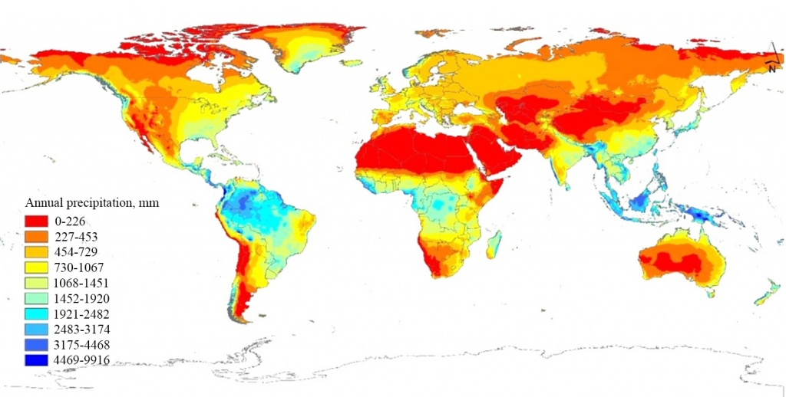
```

##### _Link de worldclim_ [aquí](https://www.worldclim.org/)
---
# SoilGRID
Contiene información sobre el tipo de suelo y la taxonomía del suelo 
```{r,echo=FALSE,fig.align='center'}
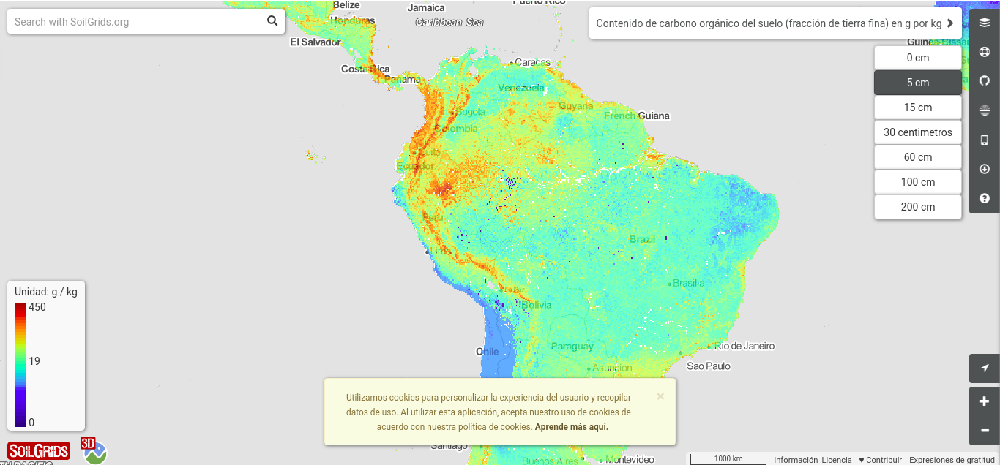
```

##### _Link de SoildGRID_ [aquí](https://soilgrids.org/#!/?layer=ORCDRC_M_sl2_250m&vector=1)
---
# OpenLandMap
Contiene información de diferentes tipos de cubiertas de la superficie terrestre como NDVI, TWI, litología, Pendiente, etc.

```{r,echo=FALSE,fig.align='center'}
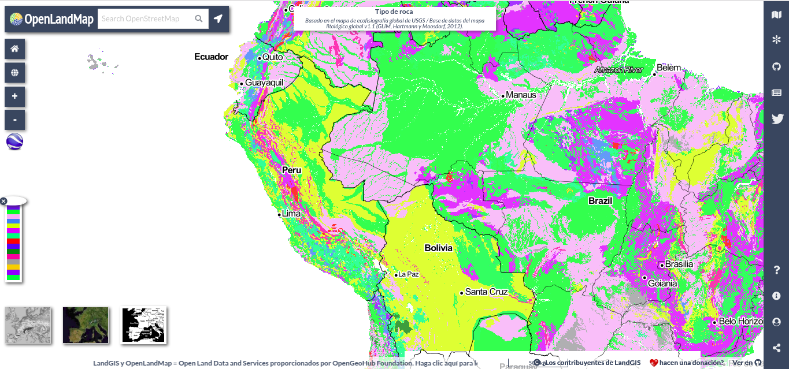
```

##### _Link de OpenLandMap_ [aquí](https://openlandmap.org)
---
# OSM
Contiene información vectorial de libre acceso 

```{r,echo=FALSE,fig.align='center'}
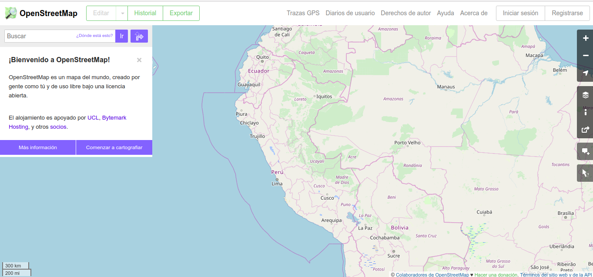
```

##### _Link de OSM_ [aquí](https://www.openstreetmap.org/#map=5/-9.297/-75.015)
---
background-size: cover
class: center, middle, inverse

# Parte práctica 

---
# Mi primer proyecto dentro de QGIS

```{r, echo=FALSE,fig.align='center'}
knitr::include_graphics("img/MiprimerProject.png")
```

---
background-size: cover
class: center, middle, inverse

# Introducción a la estadística espacial
---

# Contexto
.pull-left[
El análisis de datos espaciales se ha hecho frecuente en muchas áreas del
conocimiento como en la:

* Geografía
* Geología
* Ciencias ambientales
* Economía
* Epidemiología o medicina

**Las técnicas de estadísticas clásicas** suponen que al estudiar un fenómeno se realizan observaciones bajo circunstancias idénticas y además que las **observaciones son independientes.**
]

.pull-right[

```{r, echo=FALSE,fig.align='center', out.height='400px',out.width='300px'}
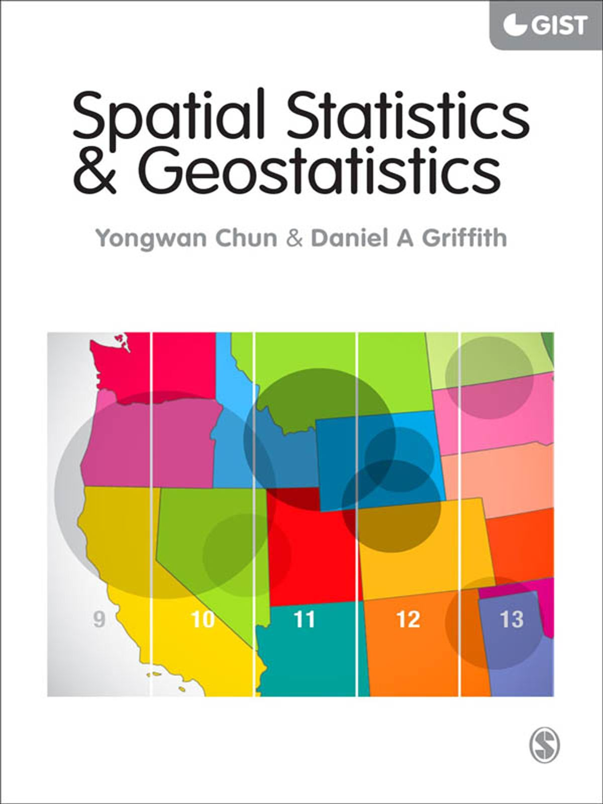
```

]

---
# Introducción a la estadística espacial
.pull-left[
La estadística clasica no es convenientes para para analizar fenómenos que varían en el tiempo o espacio, cuando se tienen datos espaciales, intuitivamente se tiene la noción de que **observaciones cercanas están correlacionadas**.

**La primera ley de la geografía** (principio de autocorrelación espacial), fue formulado por el geógrafo **Waldo Tobler**:

Todas las cosas están correlacionadas entre sí, pero las cosas más próximas en el espacio tienen una relación mayor que las distantes.
]

.pull-right[

```{r, echo=FALSE,fig.align='center', out.height='400px',out.width='300px'}
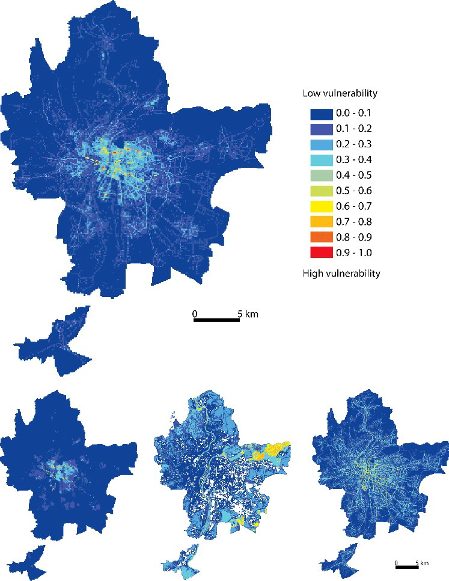
```
]
---
# Áreas de la estística espacial:

.pull-left[
### Análisis de patrones puntual
### Geoestadística
### Análisis de datos regionales
]

.pull-right[
```{r, echo=FALSE,fig.align='center', out.height='300px',out.width='200px'}
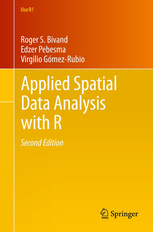
```
]

---
# Análisis regional de datos o econometría espacial 
Se recopilan tantos datos en las divisiones administrativas que existen técnicas especializadas para analizarlos.

```{r, echo=FALSE,fig.align='center', out.height='350px',out.width='650px'}
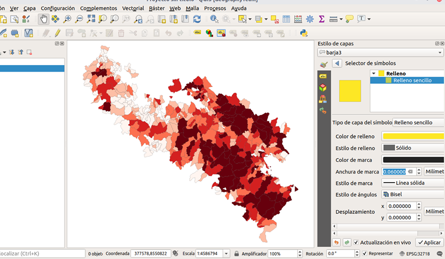
```

---
# Autocorrelación espacial 

.pull-left[
<br>

La identificación de modelos geográficos es fundamental para comprender el comportamiento de los fenómenos espaciales (Griffith,1987).

La Autocorrelación espacial nos permite indentificar patrones espaciales cuya tendencias son de agrupación, dispersión o de un proceso aleatorio de un determinado fenómeno geográfico.
]

.pull-right[
<br>
```{r, echo=FALSE,fig.align='center', out.height='300px',out.width='400px'}
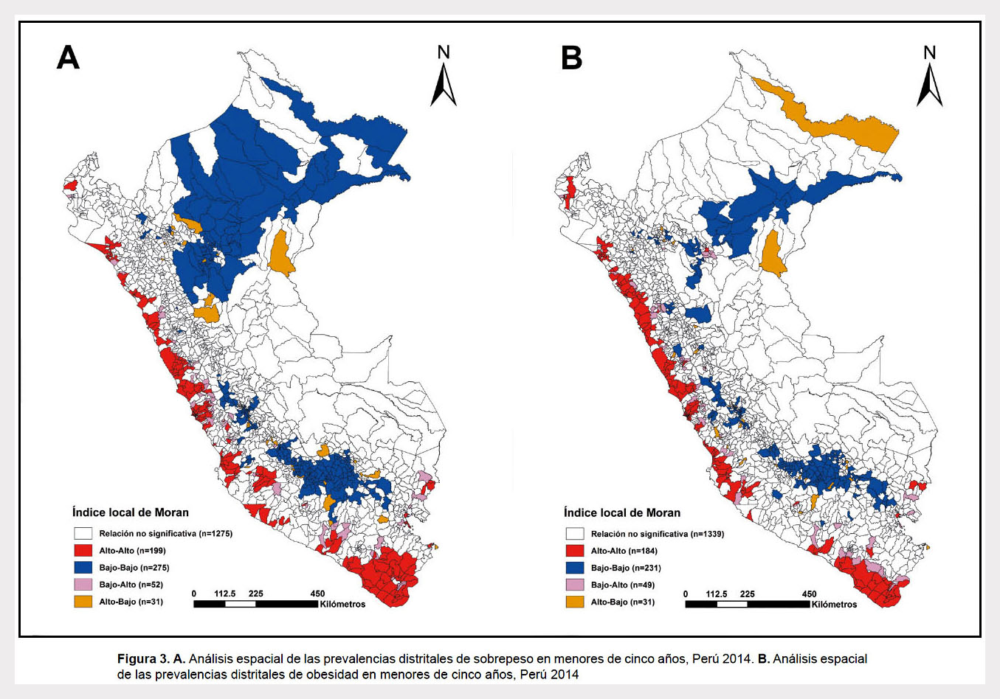
```

]

---
# Índice de Moran 

El índice de autocorrelación espacial de Moran mide esta última de acuerdo con las posiciones y valores de la entidad. Al usar un conjunto de entidades y el atributo asociado, proporciona una evaluación de si el modelo está agrupado, disperso o aleatorio, utilizando un valor de -1 a 1.
<br>
<br>
```{r, echo=FALSE,fig.align='center', out.height='200px',out.width='600px'}
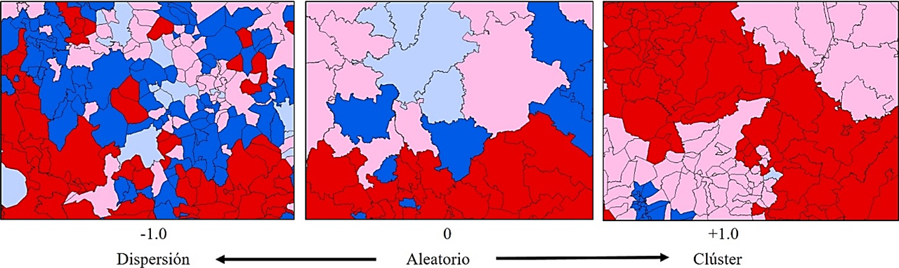
```

---
background-size: cover
class: center, middle, inverse

#Gracias !
🗺️
<div>
 
<a href="https://github.com/barja8" >barja8.github</a>
 </div>


<div>
 
 <a href="https://twitter.com/AntonyBarja1">@Antony.Barja</a>
 </div>


<div>
 
 <a href=mailto:"antony.barja8@gmail.com">antony.barja8</a>
 </div>


Slides created via the R package [**xaringan**](https://github.com/yihui/xaringan)


