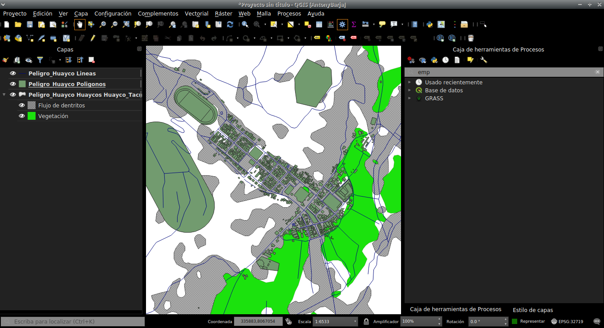

background-size: cover
class: center, middle, inverse
# Aspectos Generales de los Sistemas de Información Geográfica
---
# Qué es GIS o SIG ? 
--
<br/>
.pull-left[
Es un sistema que integra tecnología informática, personas e información geográfica y cuya función principal es capturar, analizar, almacenar, editar y representar datos georreferenciados (**Olaya,2014**).

**Desde un perpectiva técnica**:

*Es una herramienta integradora que permite manipular, gestionar y trabajar información georreferenciada*

##### _Mas información_ [aquí](http://volaya.github.io/libro-sig/)
]

.pull-left[

```{r,echo=FALSE, out.height=350,out.width=450}
knitr::include_graphics('img/Olaya.jpg')
```

]
<!-- class: inverse, center, middle -->
---
# Componentes de un SIG

```{r,echo=FALSE}
knitr::include_graphics("img/comp.png")
```

---
# Diferencia entre un SIG  y CAD 

.pull-left[
Sistema de Información Geográfica (**SIG**):
--
Diseña para reflejar la realidad, mayor peso a la **gestión de datos**

Diseño Asistido por Ordenador (**CAD**):
--
Diseña algo que no existe todavía, mayor peso a la **parte estética**

]

--
.pull-right[
```{r,echo=FALSE,out.width = "300px",fig.align='center'}
knitr::include_graphics("img/sig.gif")
```
<br>
<br>
```{r,echo=FALSE,out.width = "300px",fig.align='center'}
knitr::include_graphics("img/cad.gif")
```
]
---
# Qué son los datos espaciales?
Son todos los datos que presentan un sistema de referencia de coordenadas (src).

```{r,echo=FALSE,out.width = "650px",fig.align='center'}
knitr::include_graphics("img/latlon.png")
```

---
# Tipos de datos espaciales
<br>
--
Existen dos tipos de datos espaciales, estos son:
+ **Datos vectoriales**
+ **Datos raster**
--
<br>

```{r,echo=FALSE,fig.align='center'}
knitr::include_graphics("img/datsp.png")
```

---
# Qué es un dato vectorial?
Son **formas geométricas** (punto, linea y poligonos) que representan a los elementos geográficos que existen en el territorio

```{r,echo=FALSE,fig.align='center'}
knitr::include_graphics("img/vector.png")
```

---
# Qué es un dato raster?
Son **matrices de valores**, donde la unidad mínima es el pixel, y este contiene información geolocalizada de tipo continua.

```{r,echo=FALSE,fig.align='center'}
knitr::include_graphics("img/raster.png")
```

---
# Qué es un geoprocesamiento ? 
--
<br>
La palabra geoprocesamiento involucra varios aspectos cómo:
--
<br>
* Automatizar tareas de administración de datos: **Cortar**, **reproyectar**
--
<br>
* Modelar y análizar patrones espaciales
--
<br>
* Compartir flujos de trabajos
--
<br>
* Desarrollar sus propias herramientas
<br>
--
En conclusión:
--
<br>
##### **SON TODAS LAS OPERACIONES QUE SE REALIZAN CON DATOS GEOGRÁFICOS**.
.pull-down[
```{r,echo=FALSE,out.width = "350px",fig.align='center'}
knitr::include_graphics("img/geopro.gif")
```
]

##### _Mas información_ [aquí](http://desktop.arcgis.com/es/arcmap/10.3/main/analyze/what-is-geoprocessing.htm)

---
# Geoprocesamiento de datos vectoriales

```{r,echo=FALSE,fig.align='center'}
knitr::include_graphics("img/geo_vec.png")
```


---
# Geoprocesamiento de datos raster

```{r,echo=FALSE,fig.align='center'}
knitr::include_graphics("img/geo_raster.png")
```

---
background-size: cover
class: center, middle, inverse

# Apectos generales del GISc

---
# Introducción a OSGEO - Fundación geoespacial de codigo abierto 

.pull-left[
### ¿Qué es OSGEO?
Open Source Geospatial Foundation, es una organización no gubernamental sin fines de lucro **cuya misión es apoyar y promover el desarrollo colaborativo de software, datos y educación geoespacial de código abierto**.

```{r,echo=FALSE}
knitr::include_graphics("img/osgeo.png")
```
]

.pull-right[
```{r,echo=FALSE,fig.align='center'}
knitr::include_graphics("img/osgeo2.png")
```
]

##### _Mas información_ [aquí](https://www.osgeo.org/projects/)
---
# FOSS4G y su importancia dentro del Open Geographic Information Science ?

```{r,echo=FALSE,fig.align='center'}
knitr::include_graphics("img/OpenScience.png")
```

##### _Mas información_ [aquí](https://www.tandfonline.com/doi/pdf/10.1080/13658816.2015.1137579?needAccess=true)
---
# Qué es QGIS ?
Es un **software libre y de código abierto** que se ha convertido en un potente software SIG de escritorio que permite a los usuarios crear, editar, visualizar, analizar y publicar información geoespacial (www.qgis.org).
<br>
<br>
```{r,echo=FALSE,out.width = "660px",fig.align='center'}
knitr::include_graphics('img/qgis.gif')
```
---
# Características de QGIS
--
<br>
* Interfaz gráfica amigable
--
<br>
* Corre en múltiples sistemas operativos (GNU/Linux, Unix, Mac OS, Microsoft Windows y Android)
--
<br>
* Soporta numerosos formatos de archivos y bases de datos, así como servicios web
--
<br>
* Integra de mejor manera otros software libres como SAGA, GRASS Y R, entre otros
--
<br>
* Presenta una comunidad académica y científica muy dinámica.

```{r,echo=FALSE,out.width = "660px",fig.align='center'}
knitr::include_graphics('img/qgis2.png')
```

---
# Propina 🗺️

Actualmente, se lanza una nueva versión de QGIS cada cuatro meses; sin embargo QGIS ofrece la elegir entre diferentes versiones.
Entre ellas tenemos a la versión:
1. **LTR**:  LANZAMIENTO A LARGO PLAZO (Modificado 1 vez al año)
2. **LR**:  última versión (Modificado cada 4 meses)
3. **DEV**: Versión de prueba (Se modifica en meses, semanas o días)

```{r,echo=FALSE,out.width = "660px",fig.align='center'}
knitr::include_graphics('img/dev.png')
```

---
# Por qué usar QGIS?

```{r,echo=FALSE,out.height=400,out.width=950}
knitr::include_graphics('img/timeseries.png')
```
---
# Por qué usar QGIS?

```{r,echo=FALSE,fig.align='center'}
knitr::include_graphics('img/version.png')
```

---

background-size: cover
class: center, middle, inverse

# Instalación del software 

---
# Para un sistema operativo de **Windows**
La instalación **depende del sistema operativo (SO)**, para este ejemplo realizaremos el procedimiento de instalación para en el SO de Windows.

.pull-left[
Instalador autónomo QGIS
```{r,echo=FALSE, fig.align='center',out.width="450px"}
knitr::include_graphics("img/insta01.png")
```
]

.pull-right[
Instalador de red OSGeo4W
```{r, echo=FALSE,fig.align='center',out.width="450px",out.height="400"}
knitr::include_graphics("img/insta02.png")
```
]

---
# Para un sistema operativo de **Linux**
Esto va a depender de acuerdo al tipo de distribución, de preferencia se recomienda usar la distribución de ubuntu o sus variantes.

```sh 
deb     https://qgis.org/debian  bionic main
deb-src https://qgis.org/debian  bionic main

wget -O - https://qgis.org/downloads/qgis-2019.gpg.key | gpg --import
gpg --fingerprint 51F523511C7028C3

gpg --export --armor 51F523511C7028C3 | sudo apt-key add 

sudo apt-get update
sudo apt-get install qgis qgis-plugin-grass

```

---
# Componentes de la Interfaz Gráfica de Usuario(**GUI**) de QGIS

```{r, echo=FALSE}
knitr::include_graphics("img/gui.png")
```

---
# Explorando los diferentes contenidos que presenta la barra de menú

```{r, echo=FALSE,out.width="600px",out.height="400",fig.align='center'}
knitr::include_graphics("img/menu.gif")
```

---
# Explorarando la caja de herramientas o toolbox de QGIS

```{r, echo=FALSE,out.width="600px",out.height="400",fig.align='center'}
knitr::include_graphics("img/toolbox.gif")
```

---
# ¿Qué son los plugins y para que sirve?

.pull-left[
Los plugins son herramientas o módulos adicionales que sirven para realizar tareas o geoprocesos que no están incluidos en el mismo programa principal de QGIS.
Los lenguajes de programación que son empleados por los usuarios para crear plugins de QGIS incluyen a los lenguajes de programación como C++ y **Python**.

```{r, echo=FALSE,out.width="400px",out.height="200",fig.align='center'}
knitr::include_graphics("img/pyton.png")
```

]

.pull-right[

```{r, echo=FALSE,out.width="400px",out.height="400",fig.align='center'}
knitr::include_graphics("img/plugin.png")
```

]


---
# Cómo instalar un plugin?  

```{r, echo=FALSE,out.width=900}
knitr::include_graphics("img/installingplugin.gif")
```

---
# Instalacion de plugin para guardar proyectos

.pull-left[
Existen varios plugins para guardar proyectos dentro de QGIS y hacer de estos "transferibles" de un usuario a otro, estos son:
* **Qpackages**
* **Qconsolidate**

```{r, echo=FALSE,out.width="250px",out.height="150",fig.align='center'}
knitr::include_graphics("img/personalizacion.png")
```
]

.pull-right[

```{r, echo=FALSE,fig.align='right'}
knitr::include_graphics("img/personalizacion2.png")
```
]

---
# Propina 🗺️

```{r, echo=FALSE,fig.align='center'}
knitr::include_graphics("img/paper.png")
```

##### _Mas información_ [Paper aquí 👇](https://www.mdpi.com/2072-4292/8/5/413)
---
# Mi primer proyecto dentro de QGIS

```{r, echo=FALSE,fig.align='center'}

```

##### _Insumos_[ aquí](https://raw.githubusercontent.com/barja8/CursoQGIS3.X/master/Sesion001/Insumos/Peligro_Huayco.gpkg)
---
background-size: cover
class: center, middle, inverse

class:center,inverse
# GRACIAS!
<div>
 
<br/>
<br/>
<div>

<a href="https://github.com/ambarja" >https://github.com/ambarja</a>
 </div>

<div>
 
 <a href=mailto:"antony.barja8@gmail.com">antony.barja8@gmail.com</a>
 </div>

Slides created via the R package [**xaringan**](https://github.com/yihui/xaringan)


